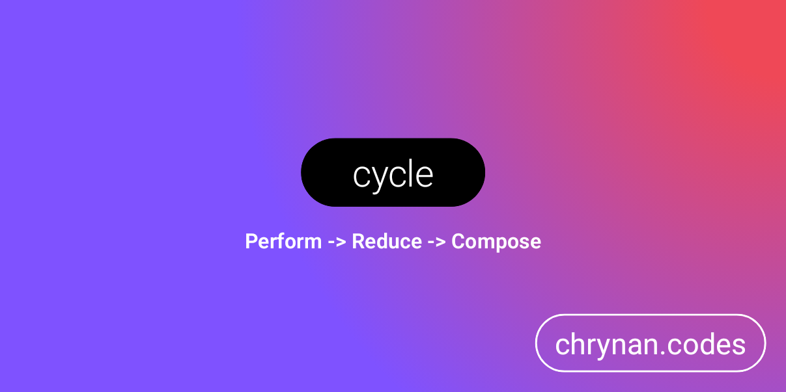

# cycle

A Kotlin multi-platform presentation layer design pattern. This is a cyclic (hence the name) uni-directional data flow
(UDF) design pattern library that is closely related to the MVI (Model-View-Intent) pattern on Android. It utilizes
kotlinx.coroutines Flows and is easily compatible with modern UI Frameworks, such as Jetpack Compose.

### Perform > Reduce > Compose

This design pattern breaks down complex application logic into three simple parts: **Perform** the actions, **Reduce**
the changes, and **Compose** the view from the state. This simple approach to application design is easy to reason
about, implement, debug, and test, and very flexible to adapt to any application's specific needs.


```kotlin
fun counterReducer(state: Int?, change: CounterChange): Int {
    val value = state ?: 0

    return when (change) {
        CounterChange.INCREMENT -> value + 1
        CounterChange.DECREMENT -> value - 1
    }
}

fun testCounter(coroutineScope: CoroutineScope) {
    val viewModel = ViewModel.create(reducer = ::counterReducer)

    viewModel.subscribe(coroutineScope = coroutineScope) { state ->
        println(state)
    }

    viewModel.dispatch(CounterChange.INCREMENT) // 1
    viewModel.dispatch(CounterChange.INCREMENT) // 2
    viewModel.dispatch(CounterChange.DECREMENT) // 1
}
```

## Getting Started 🏁

The library is provided through [Repsy.io](https://repsy.io/). Checkout the
[releases page](https://github.com/chRyNaN/presentation/releases) to get the latest version. <br/><br/>


### Repository

```kotlin
repositories {
    maven {
        url = uri("https://repo.repsy.io/mvn/chrynan/public")
    }
}
```

### Dependencies

#### core

```kotlin
implementation("com.chrynan.cycle:cycle-core:$VERSION")
```

#### compose

```kotlin
implementation("com.chrynan.cycle:cycle-compose:$VERSION")
```

## Usage 👨‍💻

### State Management (Perform and Reduce)

The first two parts of a cycle are **Perform** and **Reduce** which, together, invoke application logic that produces
changes, which then get reduced to create a new state. This process, which is illustrated below, can ultimately be
considered as state management since it involves the creation, alteration, and storage of state.

#### [Redux Counter Example](https://redux.js.org/introduction/getting-started#basic-example)

The following is an example of using a `StateStore` component from this library to implement the same example shown in
the [Redux Javascript Library's Documentation](https://redux.js.org/introduction/getting-started#basic-example), but in
Kotlin.

```kotlin
enum class CounterChange {

    INCREMENT,
    DECREMENT
}

fun counterReducer(state: Int?, change: CounterChange): Int {
    val value = state ?: 0

    return when (change) {
        CounterChange.INCREMENT -> value + 1
        CounterChange.DECREMENT -> value - 1
    }
}

fun testCounter(coroutineScope: CoroutineScope) {
    val store = MutableStateStore(reducer = ::counterReducer)

    store.subscribe(coroutineScope = coroutineScope) { state ->
        println(state)
    }

    coroutineScope.launch {
        store.dispatch(CounterChange.INCREMENT) // 1
        store.dispatch(CounterChange.INCREMENT) // 2
        store.dispatch(CounterChange.DECREMENT) // 1
    }
}
```

The above example is a good simple demonstration, but it isn't very useful for more complex, "real-world" applications.
While the fundamentals are the same, applications often require a more complex flow of logic. Coordinating the flow of
logic efficiently between different application components is the responsibility of a design pattern.

There are many application level design patterns (MVC, MVP, MVVM, MVI, to name a few), but this library focuses on MVVM
and MVI design patterns, since those are easily reactive (using Kotlin Coroutine Flows) and easily supportive of the
UDF (uni-directional data flow) design principal. There is a `ViewModel` component provided by this library which can
encapsulate component specific functionality. The above example can be updated to utilize a `ViewModel` and perform
more complex actions at the call-site:

```kotlin
fun testCounter(coroutineScope: CoroutineScope) {
    val viewModel = ViewModel.create(reducer = ::counterReducer)

    viewModel.subscribe(coroutineScope = coroutineScope) { state ->
        println(state)
    }

    viewModel.dispatch(CounterChange.INCREMENT) // 1
    viewModel.dispatch(CounterChange.INCREMENT) // 2
    viewModel.dispatch(CounterChange.DECREMENT) // 1

    // The provided action will be invoked and must return a Flow of changes
    // 2
    viewModel.perform {
        flow {
            emit(CounterChange.INCREMENT)

            if ((viewModel.currentState ?: 0) > 2) {
                emit(CounterChange.DECREMENT)
            }
        }
    }
}
```

The above example illustrates the usage of the `ViewModel.perform` function, which takes an `Action` value as a
parameter. An `Action` is simply a `typealias` for a suspending function that takes the current `State` as a parameter
and returns a `Flow` of `Changes`. This function is typically not invoked at the call-site, as in the example above,
but instead invoked by `ViewModel` implementing classes. This forces the logic to be well-defined, encapsulated within
a single component, and easily testable. The above example re-written to use a custom `ViewModel` might look like the
following:

```kotlin
class CounterViewModel : ViewModel<Int, CounterChange>(
    stateStore = MutableStateStore(reducer = ::counterReducer)
) {

    fun increment() = dispatch(CounterChange.INCREMENT)

    fun decrement() = dispatch(CounterChange.DECREMENT)

    fun incrementIfLessThanTwo() = perform {
        flow {
            emit(CounterChange.INCREMENT)

            if ((currentState ?: 0) > 2) {
                emit(CounterChange.DECREMENT)
            }
        }
    }
}

fun testCounter(coroutineScope: CoroutineScope) {
    val viewModel = CounterViewModel()

    viewModel.subscribe(coroutineScope = coroutineScope) { state ->
        println(state)
    }

    // Note: The dispatch function is no longer public, so we can't access it here.
    viewModel.increment() // 1
    viewModel.increment() // 2
    viewModel.decrement() // 1

    // Note: The perform function is no longer public, so we can't access it here.
    viewModel.incrementIfLessThanTwo() // 2
}
```

Another common design pattern is MVI (Model-View-Intent). With this design pattern, an `Intent` model is emitted on the
`ViewModel's` reactive stream, which triggers an associated `Action`, resulting in a `Flow` of `Changes` being emitted
and reduced to produce new `States`. This is similar to the above example, but instead of having separate functions on
the `ViewModel` for each action, we will have a single `intent(to:)` function on the `ViewModel` that takes an `Intent`
model and performs the appropriate action based on that value. This approach can easily be implemented with this
library by extending the `IntentViewModel` class:

```kotlin
enum class CounterIntent {

    INCREMENT,
    DECREMENT,
    INCREMENT_IF_LESS_THAN_TWO
}

enum class CounterChange {

    INCREMENTED,
    DECREMENTED,
    NO_CHANGE
}

fun counterReducer(state: Int?, change: CounterChange): Int {
    val value = state ?: 0

    return when (change) {
        CounterChange.INCREMENTED -> value + 1
        CounterChange.DECREMENTED -> value - 1
        CounterChange.NO_CHANGE -> value
    }
}

class CounterViewModel : IntentViewModel<CounterIntent, Int, CounterChange>(
    stateStore = MutableStateStore(reducer = ::counterReducer)
) {

    override fun performIntentAction(state: Int?, intent: CounterIntent): Flow<CounterChange> = flow {
        val change = when (intent) {
            CounterIntent.INCREMENT -> CounterChange.INCREMENTED
            CounterIntent.INCREMENT_IF_LESS_THAN_TWO -> CounterChange.NO_CHANGE
            CounterIntent.DECREMENT -> CounterChange.DECREMENTED
        }

        emit(change)
    }
}

fun testCounter(coroutineScope: CoroutineScope) {
    val viewModel = CounterViewModel()

    viewModel.subscribe(coroutineScope = coroutineScope) { state ->
        println(state)
    }

    // Note: The dispatch function is no longer public, so we can't access it here.
    viewModel.intent(to = CounterIntent.INCREMENT) // 1
    viewModel.intent(to = CounterIntent.INCREMENT) // 2
    viewModel.intent(to = CounterIntent.DECREMENT) // 1

    // Note: The perform function is no longer public, so we can't access it here.
    viewModel.intent(to = CounterIntent.INCREMENT_IF_LESS_THAN_TWO)
}
```

### Compose

The third and final part of a cycle is **Compose** which is responsible for listening to new states and updating a UI
view accordingly. This part's implementation is dependent on the UI framework used, but can easily be adapted to fit
most modern UI frameworks.

The easiest way to subscribe to state changes to update the UI, is to use the `subscribe` function:

```kotlin
viewModel.subscribe(coroutineScope = coroutineScope) { state ->
    // Update the UI or trigger a UI refresh here using the new state.
}
```

Or you can use the [cycle-compose](#dependencies) dependency when targeting Jetpack Compose for a simple integration:

```kotlin
@Composable
fun Home(viewModel: HomeViewModel) {
    val state = viewModel.stateChanges()

    // Use the state to construct the UI.
}
```

## Documentation 📃

More detailed documentation is available in the [docs](docs/) folder. The entry point to the documentation can be
found [here](docs/index.md).

## Security 🛡️

For security vulnerabilities, concerns, or issues, please responsibly disclose the information either by opening a
public GitHub Issue or reaching out to the project owner.

## Contributing ✍️

Outside contributions are welcome for this project. Please follow the [code of conduct](CODE_OF_CONDUCT.md)
and [coding conventions](CODING_CONVENTIONS.md) when contributing. If contributing code, please add thorough documents.
and tests. Thank you!

## Sponsorship ❤️

Support this project by [becoming a sponsor](https://www.buymeacoffee.com/chrynan) of my work! And make sure to give the
repository a ⭐

## License ⚖️

```
Copyright 2021 chRyNaN

Licensed under the Apache License, Version 2.0 (the "License");
you may not use this file except in compliance with the License.
You may obtain a copy of the License at

   http://www.apache.org/licenses/LICENSE-2.0

Unless required by applicable law or agreed to in writing, software
distributed under the License is distributed on an "AS IS" BASIS,
WITHOUT WARRANTIES OR CONDITIONS OF ANY KIND, either express or implied.
See the License for the specific language governing permissions and
limitations under the License.
```
